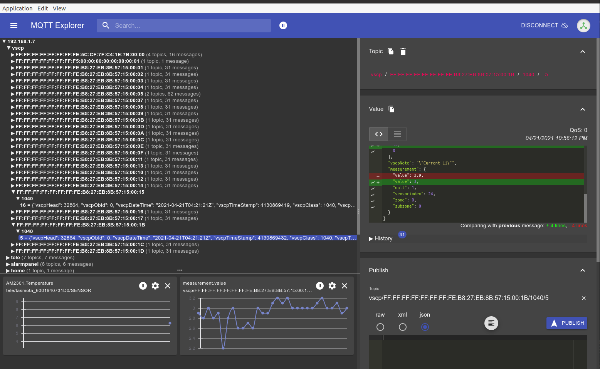
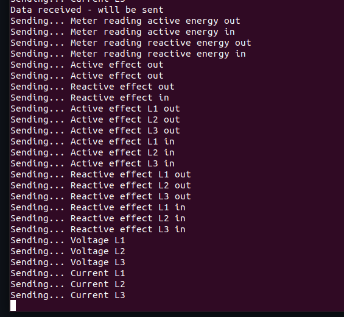

# vscp-python-p1-power-meter


This project consist of a scripts to deliver data from a smart electrical meter with p1 interface. It has currently only been tested with Sagemcom T211

It will deliver VSCP events for

* Used energy in/out (active and reactive),
* Active and reactive effect (in/out).
* Active and reactive effect for each phase (in/out).
* Voltage for each phase.
* Current for each phase.
* Phasefactor for each phase.

Typically the scripts is used in a [cron job](https://ostechnix.com/a-beginners-guide-to-cron-jobs/) to deliver the events on timed intervals or is run in and endless loop.


## Install

### Prerequisites

The code here is dependent on the [VSCP helper library](https://github.com/grodansparadis/vscp-helper-lib). Therefore you have to install this package first. It is available for Debian type systems including Raspberry Pi. Check and download the latest version [here](https://github.com/grodansparadis/vscp-helper-lib/releases)

For convenience this is how the current version is installed on a Raaspberry Pi

```bash
wget https://github.com/grodansparadis/vscp-helper-lib/releases/download/v14.0.2/libvscphelper14_14.0.2-1_armhf.deb

wget https://github.com/grodansparadis/vscp-helper-lib/releases/download/v14.0.2/libvscphelper14-dev_14.0.2-1_armhf.deb

sudo dpkg -i ./libvscphelper14_14.0.2-1_armhf.deb
sudo dpkg -i ./libvscphelper14-dev_14.0.2-1_armhf.deb

```

Note that there may be [later versions available)(https://github.com/grodansparadis/vscp-helper-lib/releases) then the one downloaded above. You should **always** install the latest version.


### Install the package

The scripts are available as a package **vscp-python-p1-power-meter** on [PyPi](https://pypi.org/project/vscp-python-p1-power-meter/). This means you can do an automatic install with pip that will handle all dependencies expect for the helper library mentioned above which must be install manually.

The installation process is easy

```bash
pip3 install vscp-python-p1-power-meter
```

To later upgrade to the latest version use

```bash
pip3 install --upgrade vscp-python-p1-power-meter
```

It is not required but recommended to install in a virtual environment To install in a virtual environment in your current project:

```bash
mkdir project-name && cd project-name
python3 -m venv .env
source .env/bin/activate
```

then do the install of **vscp-python-p1-power-meter** as of above.

After install you can use **mqtt-p1-power-meter.py** from the command line. Info on how to configure the scripts for your needs are below.

### Manual Install

For some reason you may not want to use PyPi and want to download the scripts from the [github repository](https://github.com/grodansparadis/vscp-python-p1-power-meter). 

The script depends on some other modules that you need to install before using it. It is recommended to install everything in a virtual environment.

As mentioned above you need to install the VSCP helper library before installing this module.

It is recommended to install in a virtual environment in your current project:

```bash
git clone https://github.com/grodansparadis/vscp-python-p1-power-meter.git
cd vscp-python-p1-power-meter
python3 -m venv .env
source .env/bin/activate
```

You may need to install Python venv with 

```bash
apt install python3-venv
```
if it's not installed.

#### Configparser

Configparser can be found on [PyPi](https://pypi.org/) and is documented [https://docs.python.org/3/library/configparser.html](here). Install with

```bash
pip3 install configparser
```

#### Install VSCP modules

**pyvscphelper** is not needed if only MQTT should be used. You can install the modules from [PyPi](https://pypi.org/)

```bash
pip3 install pyvscp
pip3 install pyvscphelper
```

If you need them on more places either go for a global install or use a virtual environment and install all the modules in it.

#### Install MQTT module

For MQTT functionality Paho MQTT module is needed. You can install the modules from PyPi

```bash
pip3 install paho-mqtt
```

## Configure

You setup the code by either editing the scripts or create a configuration file with the settings. In the scripts all relevant values can be found in the beginning of the file along with documentation.

The settings are named the same in the config file as in the script itself so the documentation for the configuration file is valid also for directly adding the scripts.

To get help you can issue

```bash
mqtt-p1-power-meter.py --help
```

on the command line after the module is installed.

The recommended way to configure the scripts is to use a configuration file and store this file in a safe location as it contains usernames and password and in that way can protect this sensitive information. The syntax to instruct the script to read a configuration file is

```bash
mqtt-p1-power-meter.py --configure path-to-config-file
```

So 

```bash
mqtt-p1-power-meter.py --configure ./config.ini
```

will read the configuration from _./config.ini_

## Sample configuration file

If you install in a virtual environment as recommended above you will find a sample configuration file in 

>_.env/p1-power-meter-samp

For a standard install you find it in

>_.local/p1-power-meter-samp

and for a global install you can get the path by issuing

```bash
pip3 -V
```

## Command line switches

### -h --help
Display information on how to use the script.

### -c --config
Path to configuration file. **Default:** ./config.ini

### -v --verbose
Enable verbose output. **Default:** false

### -d --debug
Enable debug mode. **Default:** false

### -s --oneshot
Enable one-shot. Normally the script runs in an endless loop. With one shot enabled only one loop will be performed. Suitable when the script is used as a cron script. **Default:** false

## config file content

### The GENERAL section

#### one_shot
Set to true to enable one shot mode. Normally the script runs in an endless loop. With one shot enabled only one loop will be performed. Suitable when the script is used as a cron script. **Default:** false

#### no_vscp
If you hate VSCP this is the switch for you. the note string for each value becomes the MQTT topic and the value will be published under this topic. Not a trace from VSCP is any longer visible t the outside world. **Default:** false

#### send_energy
Send the energy readings. Four values for the meter readings are sent. In/out and both active and reactive energy. **Default:** true

#### send_active_effect = true 
Send the active effect readings. A total of six readings are reported. In/out for each phase(L1,L2,L3). **Default:** true

#### send_reactive_effect = true
Send the reactive effect readings. A total of six readings are reported. In/out for each phase(L1,L2,L3). **Default:** true

#### send_voltage = true
Send the voltage readings. 
One reading for all phases (L1,L2,L3) is sent.
**Default:** true

#### send_current = true
Send the current readings. 
One reading for all phases (L1,L2,L3) is sent.
**Default:** true 

### The [VSCP] section

#### guid

The scripts use the MAC address of the machine they are run on to construct a GUID on the format

> FF:FF:FF:FF:FF:FF:FF:FE:M5:M4:M3:M2:M1:M0:id1:id0

where _M5:M4:M3:M2:M1:M0_ is the MAC address and _id1:id0_ sensor id. 

If you don't want this you can supply your own GUID here. Note that the two lowest positions also now is used for id's so normally the GUID should have zeros in these positions.

#### Sensor indexes

Normally the GUID and the id for the measurement value is used to identify the sensor. Using the sensor index is an alternative

| name | default index |
| ---- | ------------- |
| sensorindex_sum_active_energy_out | 1 |
| sensorindex_sum_active_energy_in | 2 |
| sensorindex_sum_reactive_energy_out | 3 |
| sensorindex_sum_reactive_energy_in | 4 |
| sensorindex_momentan_active_effect_out | 5 |
| sensorindex_momentan_active_effect_in | 6 |
| sensorindex_momentan_reactive_effect_out | 7 |
| sensorindex_momentan_reactive_effect_in | 8 |
| sensorindex_momentan_active_effect_l1_out | 9 |
| sensorindex_momentan_active_effect_l1_in | 10 |
| sensorindex_momentan_active_effect_l2_out | 11 |
| sensorindex_momentan_active_effect_l2_in | 12 |
| sensorindex_momentan_active_effect_l3_out | 13 |
| sensorindex_momentan_active_effect_l3_in | 14 |
| sensorindex_momentan_reactive_effect_l1_out | 15 |
| sensorindex_momentan_reactive_effect_l1_in | 16 |
| sensorindex_momentan_reactive_effect_l2_out | 17 |
| sensorindex_momentan_reactive_effect_l2_in | 18 |
| sensorindex_momentan_reactive_effect_l3_out | 19 |
| sensorindex_momentan_reactive_effect_l3_in | 20 |
| sensorindex_voltage_l1 | 21 |
| sensorindex_voltage_l2 | 22 |
| sensorindex_voltage_l3 | 23 |
| sensorindex_current_l1 | 24 |
| sensorindex_current_l2 | 25 |
| sensorindex_current_l3 | 26 |

#### zone

Set the zone to a value between 0-255 if you need it. Default is zero.

#### subzone

Set the subzone to a value between 0-255 if you need it. Default is zero.

#### Sensor id's

Set id to a value between 0-65535 to set the id for the reported value. This is the two LSB bytes of the GUID used to report the sensor value.

| name | default id |
| ---- | ---------- |
| id_sum_active_energy_out | 1 |
| id_sum_active_energy_in | 2 |
| id_sum_reactive_energy_out | 3 |
| id_sum_reactive_energy_in | 4 |
| id_momentan_active_effect_out | 5 |
| id_momentan_active_effect_in | 6 |
| id_momentan_reactive_effect_out | 7 |
| id_momentan_reactive_effect_in | 8 |
| id_momentan_active_effect_l1_out | 9 |
| id_momentan_active_effect_l1_in | 10 |
| id_momentan_active_effect_l2_out | 11 |
| id_momentan_active_effect_l2_in | 12 |
| id_momentan_active_effect_l3_out | 13 |
| id_momentan_active_effect_l3_in | 14 |
| id_momentan_reactive_effect_l1_out | 15 |
| id_momentan_reactive_effect_l1_in | 16 |
| id_momentan_reactive_effect_l2_out | 17 |
| id_momentan_reactive_effect_l2_in | 18 |
| id_momentan_reactive_effect_l3_out | 19 |
| id_momentan_reactive_effect_l3_in | 20 |
| id_voltage_l1 | 21 |
| id_voltage_l2 | 22 |
| id_voltage_l3 | 23 |
| id_current_l1 | 24 |
| id_current_l2 | 25 |
| id_current_l3 | 26 |


### The [MQTT] section

### host

The address for the MQTT broker which will get reported values.

### port

Port on the MQTT broker.

### user

Username used to login to MQTT broker.

### password

Password used to login to MQTT broker.

### topic

This is the topic under which the VSCP events will be sent. The default is

> vscp/{xguid}/{xclass}/{xtype}

- _{xguid}_ will be replaced with the GUID of the event.
- _{xclass}_ will be replaced with the VSCP class of the event.
- _{xtype}_ will be replaced with the VSCP type of the event.

### notes
| name | default |
| ---- | ------- |
| note_sum_active_energy_out | Meter reading active energy out |
| note_sum_active_energy_in | Meter reading active energy in |
| note_sum_reactive_energy_out | Meter reading reactive energy out |
| note_sum_reactive_energy_in | Meter reading reactive energy in |
| note_momentan_active_effect_out | Active effect out |
| note_momentan_active_effect_in | Active effect in |
| note_momentan_reactive_effect_out | Reactive effect out |
| note_momentan_reactive_effect_in | Reactive effect in |
| note_momentan_active_effect_l1_out | Active effect L1 out |
| note_momentan_active_effect_l1_in | Active effect L1 in |
| note_momentan_active_effect_l2_out | Active effect L2 out |
| note_momentan_active_effect_l2_in | Active effect L2 in |
| note_momentan_active_effect_l3_out | Active effect L3 out |
| note_momentan_active_effect_l3_in | Active effect L3 in |
| note_momentan_reactive_effect_l1_out | Reactive effect L1 out |
| note_momentan_reactive_effect_l1_in | Reactive effect L1 in |
| note_momentan_reactive_effect_l2_out | Reactive effect L2 out |
| note_momentan_reactive_effect_l2_in | Reactive effect L2 in |
| note_momentan_reactive_effect_l3_out | Reactive effect L3 out |
| note_momentan_reactive_effect_l3_in | Reactive effect L3 in |
| note_voltage_l1 | Voltage L1 |
| note_voltage_l2 | Voltage L2 |
| note_voltage_l3 | Voltage L3 |
| note_current_l1 | Current L1 |
| note_current_l2 | Current L2 |
| note_current_l3 | Current L3 |

### Serial section

#### serial_port
The serial port to use. **Default:** /dev/ttyUSB1

#### serial_baudrate
The serial baudrate to use. **Default:** 115200

#### serial_timeout
This is the timeout for reading a line of data. Should normally be greater than 10 which is the number of seconds the meter sends data. **Default:** 20  

## using

After you have installed the module and created a configuration file test the script with

```bash
mqtt-p1-power-meter.py -v -c path-to-config
```

the MQTT broker you have defined should receive the events under the defined topics like this



and you will get some verbose info on the screen like this



now you can add the script to cron to get measurement events sent to your broker on even intervals.

## node-red and node.js

with the VSCP tools available for node.js and node-red you can easily graph and in other ways handel the published measurement data.

- You find node.js tools [here](https://www.npmjs.com/search?q=node-vscp)
- You find node-red tools [here](https://flows.nodered.org/search?term=node-red-contrib-vscp)


## VSCP

For VSCP you find info at the [VSCP main site](https://www.vscp.org)

VSCP docs are collected [here](https://docs.vscp.org/).


----

If you are interested in learning more about VSCP the main site is [here](https://www.vscp.org)

Copyright © 2000-2020 Ake Hedman, Grodans Paradis AB - MIT license.

